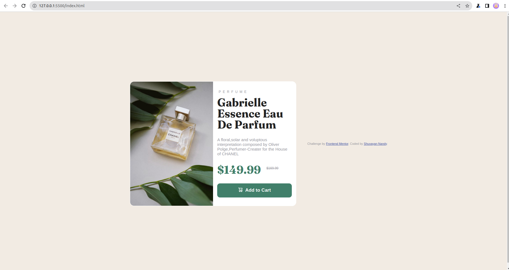

# Frontend Mentor - Product preview card component solution

This is a solution to the [Product preview card component challenge on Frontend Mentor](https://www.frontendmentor.io/challenges/product-preview-card-component-GO7UmttRfa). Frontend Mentor challenges help you improve your coding skills by building realistic projects.

## Table of contents

- [Overview](#overview)
  - [The challenge](#the-challenge)
  - [Screenshot](#screenshot)
  - [Links](#links)
- [My process](#my-process)
  - [Built with](#built-with)
  - [What I learned](#what-i-learned)
  - [Continued development](#continued-development)
  - [Useful resources](#useful-resources)
- [Author](#author)
- [Acknowledgments](#acknowledgments)

## Overview

### The challenge

Users should be able to:

- View the optimal layout depending on their device's screen size
- See hover and focus states for interactive elements

### Screenshot



### Links

- Live Site URL: [Add live site URL here](https://shuvayan19.github.io/FeM/)

## My process

### Built with

- Semantic HTML5 markup
- CSS custom properties
- Flexbox
- CSS Grid
- Mobile-first workflow

### What I learned

To match the exact grade of the color used in button i have used gimp

To see how you can add code snippets, see below:
to change the image as per resolution used media query with the adjacent classes

```
html
<header>
        
        
      </header>
```

### Useful resources

- [w3schools](https://www.w3schools.com/css/css_grid.asp) - This helped me to understand grid layout more clearly .

## Author

- Frontend Mentor - [@Shuvayan19](https://www.frontendmentor.io/profile/Shuvayan19)

## Acknowledgments

Lastly I am greatly thankful to MoshHamedani, his tutorial made my vision clear on css and html
